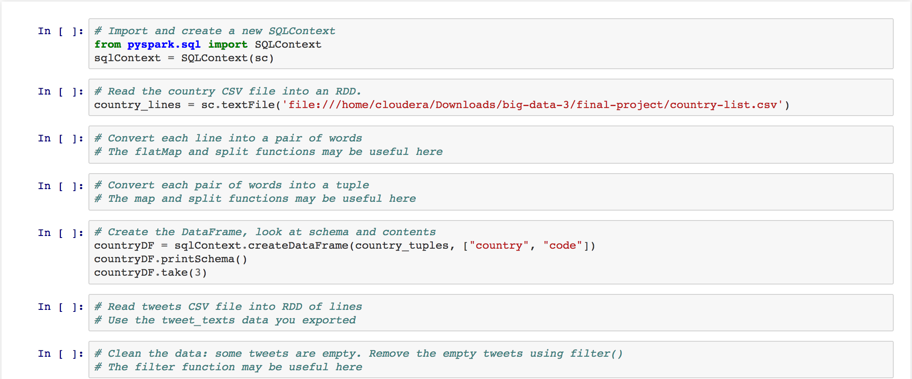
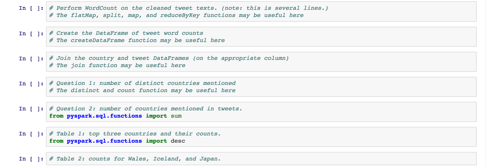

# Learn By Doing: Putting MongoDB and Spark to Work

## Assignment: Querying and Exporting from MongoDB

### Let's Analyze Soccer Tweets!

This week we have a case study for you to exercise what you learned so far. 

The Soccer World Cup is here! A lot of fans are tweeting their opinions about the games, their favorite players and  teams of their countries. 

Imagine that you are a "Sports Analyst" and you are trying to understand the behavior of fans across the globe. You turn to Twitter as a platform that you can access to the fans.

We give you a dataset that you are already familiar with from the hands-on for MongoDB. You will have two assignments involving analytics on this dataset. 

[ The data set for this exercise may be obtained in the lesson on 'Querying Documents in MondoDB' at https://www.coursera.org/learn/big-data-integration-processing/supplement/R93cO/querying-documents-in-mongodb ] (see in [folder](../big-data-3/mongodb/))

### Expressing Analytical Questions as MongoDB Queries

[ The data set for this exercise may be obtained in the lesson on 'Querying Documents in MondoDB' at https://www.coursera.org/learn/big-data-integration-processing/supplement/R93cO/querying-documents-in-mongodb ]

Imagine you are the Sports Analyst for a big magazine. The goal of this assignment is to demonstrate your data-driven reporting skills and express the following natural language questions as MongoDB queries on soccer-related tweets in English.

- Query 1: How many tweets have location not null?
- Query 2: How many people have more followers than friends?
- Query 3: Return text of tweets which have the string "http://" ?
- Query 4: Return all the tweets which contain text "England" but not "UEFA" ?
- Query 5: Get all the tweets from the location "Ireland" and contains the string "UEFA"? 
  
Don't forget to save the results of your queries as you will have a quiz testing the correctness of your query results following this exercise.

### Exporting Data from MongoDB to a CSV File

Although it is possible to just work with MongoDB on some analytical platforms, a lot of data scientists use an analysis platform that cannot work with MongoDB directly. A common practice in data science is to export all or part of the data into a CSV file that almost any analytical tool can import. 

You can export the result of MongoDB queries using the mongoexport command in the terminal shell. This command uses the following arguments:

The mongoexport file is located in `/big-data-3/mongodb/bin/`. The format of the command is as follows: 

```./bin/mongoexport --db  <dbname> --collection <collectionName> --out  <OutfileName>```

Your assignment is to export user data from the sample db to any output file. 

| Argument | Description |
| --- | --- |
| --collection <name> | The collection to use. |
| --db <name> | The database to use. |
| --fields <field 1>,<field 2>,<...> | The fields to include in the query result. |
| --query <query> | The query to perform. |
| --out <name> | The name of the output file. |
| --type=<type> | Format of export, either csv or json. |

In this exercise, we ask you to export your tweet  data from MongoDB to a CSV file. In Part 2, we will be performing analytics on the tweet texts, so export this field from MongoDB into a CSV file.

## Assignment: Analysis using Spark

# capstone internship

Now that you are familiar with the dataset and exported it into a CSV file, let's start integrating this dataset with another small dataset and analyze it in Spark.

To run PySpark in the Cloudera VM, you will first need to run the setup script: **[setupWeek3.sh](https://github.com/words-sdsc/courseraDataSimulation/blob/master/capstone/readings/setupWeek3.sh)**

Then open PySpark in the VM with the following command: pyspark --packages com.databricks:spark-csv_2.10:1.5.0

As the Sports Analyst, you are very interested in reporting on the countries with the most popularity in Twitter. So a good way to approach this problem would be to find which countries were mentioned the most in the tweets in your dataset and to analyze what words are being used the most in these tweets.

In addition to the CSV file you just exported from MongoDB, we give you a small dataset with the codes and names of some countries. To see this additional dataset, open the following file:

- `Downloads/big-data-3/final-project/country-list.csv`

To get you started, we have prepared a Jupyter notebook template, and started a SparkSQL context for you. Please open the notebook in:

- `Downloads/big-data-3/final-project/SoccerTweetAnalysis.ipynb`

You will use this notebook to answer the questions below. So let’s get started.

**Question 1:** As a Sports Analyst, you are interested in how many different countries are mentioned in the tweets. Use the Spark to calculate this number. Note that regardless of how many times a single country is mentioned, this country only contributes 1 to the total.

**Question 2:** Next, compute the total number of times any country is mentioned. This is different from the previous question since in this calculation, if a country is mentioned three times, then it contributes 3 to the total.

**Question 3:** Your next task is to determine the most popular countries. You can do this by finding the three countries mentioned the most.

**Question 4:** After exploring the dataset, you are now interested in how many times specific countries are mentioned. For example, how many times was France mentioned?

**Question 5:** Which country has the most mentions: Kenya, Wales, or Netherlands?

**Question 6:** Finally, what is the average number of times a country is mentioned?

Here is a copy of the Jupyter notebook template with added **HINTS**:




Don't forget to save the results of your analysis as you will have a quiz testing the correctness of these results following this exercise.

### Analyzing Tweets About Countries

