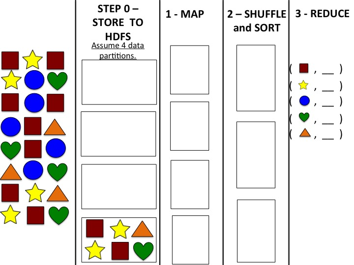

# instructions

MapReduce is the core programming model for the
Hadoop Ecosystem.  We’ve found it’s
really helpful to walk through the steps of MapReduce for yourself in order to
internalize how it really works.  In
video lecture, we walked through the steps of MapReduce to count words -- our keys were words.  In this exercise, we’ll have you count
shapes -- the keys will be shapes.

Note:  This assignment
can be done in PPT and printed to PDF or on paper and submitted as a
picture.  Template in PPT, template in JPG.



> see file template in pptx [here](PeerReviewforUploadTemplate.pptx)

Your job is to perform the steps of MapReduce to calculate a
count of the number of squares, stars, circles, hearts and triangles in the dataset shown in the picture above.  You should follow the steps of
MapReduce as they were explained in [this video](https://www.coursera.org/learn/big-data-introduction/lecture/pL4NH/mapreduce-simple-programming-for-big-results).

**Step 0:** Store the dataset across 4 partitions in HDFS. **Note: we have already done one partition for you.   Hint: Balance the load, but there is more than on possible “correct” partitioning.**

**Step 1:** Map the data. 
**Hint: Mapping involves clustering like keys together.  Show this in the visual placement of keys within a
partition.**

**Step 2:** Sort and Shuffle. 
**Note: as mentioned in lecture, you don’t have to use the same number of
nodes in this step as you did before. 
Let’s use three instead.  Hint:
Balance the load.**

**Step 3:**  Reduce to
calculate the final counts.  **Hint:  Fill in the blank lines to finalize the key-value pairs**

**Modification: Simplify drawing the key-value pair**

The “Map” stage of MapReduce generates key-value pairs.  For example, in the video we saw:

```bash
my, my ->  (my, 1), (my,1)
```

Showing that two instances of the word “my” would get mapped
to two key-value pairs.  You might have
noticed that until the Reduce step, the value in all key-value pairs is 1.  To make this activity less cluttered visually,
we will have you leave out the “,1” part of each key-value pair, and just
represent a key-value pair with the appropriate image.

## review criteria

You will be reviewed based on:

- Whether your steps appropriately
document data movement or analysis in Steps 0-2 (see hints in Step descriptions
above).
- You get correct final counts in
Step 3.  (Yes, we know you can count –
but it’s the process!)

Note: More than one single "correct" answer exists for this assignment.