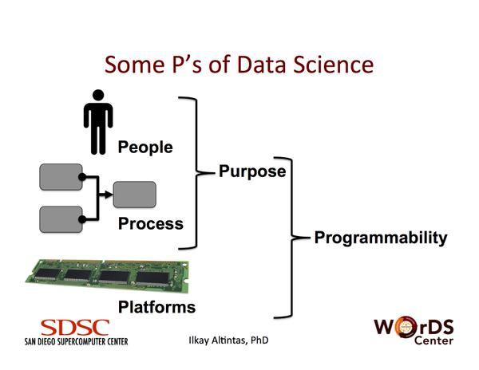
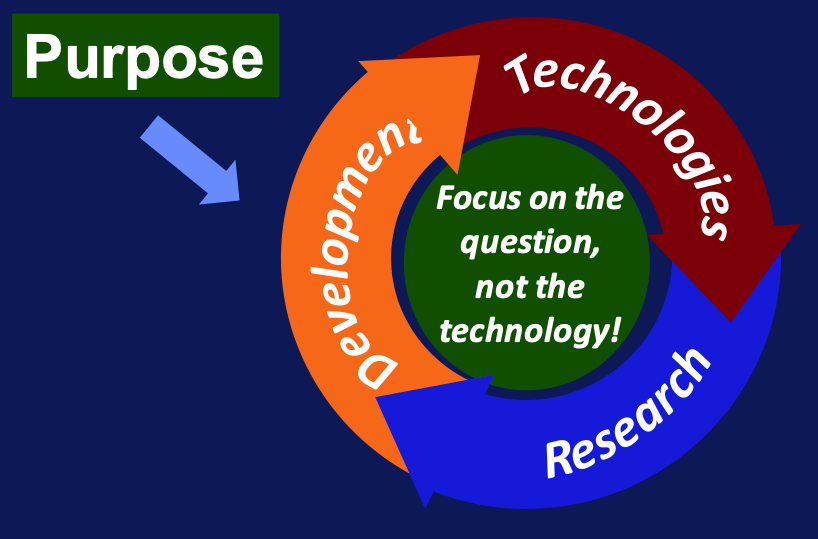
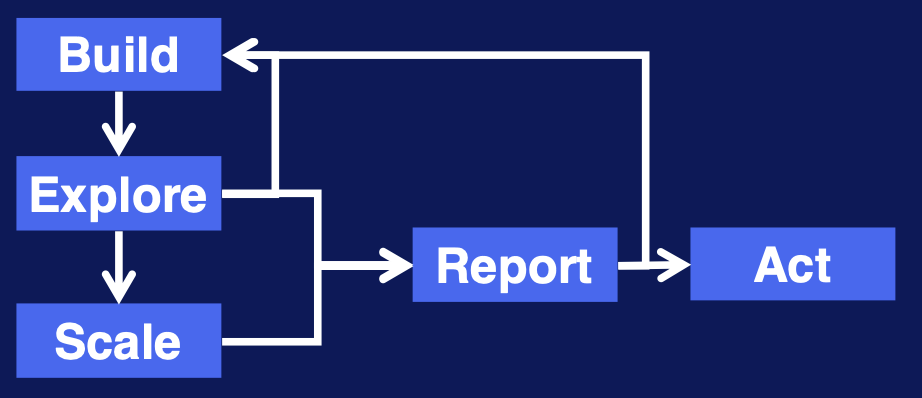
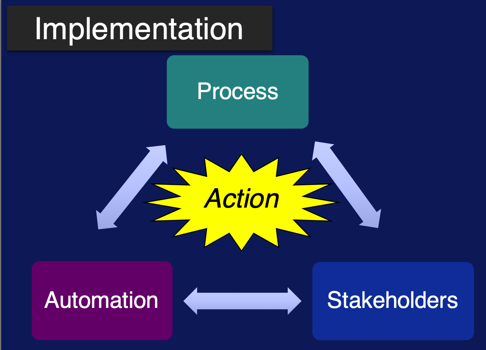
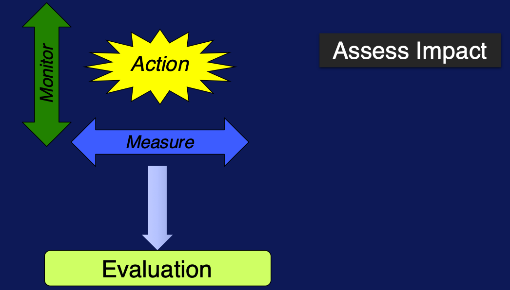
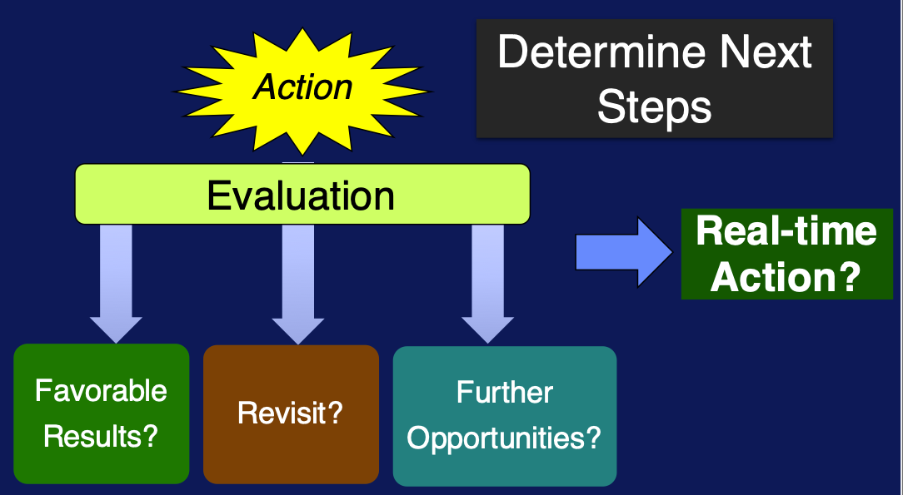

# characteristics of bigdata and dimensions of scalability

## characteristics of big data

big data is a blanket term that is used to refer to any collection of data so large and complex that it exceeds the processing capability of conventional data management systems and techniques.

**characteristics**:
1. [volume](#volume): vast amounts of data that is generated every second, mInutes, hour, and day in our digitized world.
2. [variety](#variety): refers to the ever increasing different forms that data can come in such as text, images, voice, and geospatial data.
3. [velocity](#velocity):  refers to the speed at which data is being generated and the pace at which data moves from one point to the next.
   
volume, variety, and velocity are the **three main** dimensions that characterize big data

4. [veracity](#veracity): refers to the biases, noise, and abnormality in data. Or, better yet, It refers to the often unmeasurable uncertainties and truthfulness and trustworthiness of data
5. [valence](#valence): refers to the connectedness of big data in the form of graphs, just like atoms.

### volume

volume `=` size: volume is the big data dimension that relates to the sheer size of big data. is the dimension related to its size and its exponential growth.

data at an **astronomical** scale: **exponential** growth in data volume and storage.

relevance of volume? businesses and organizations are collecting and leveraging large volumes of data to improve their end products, whether it is safety, reliability, healthcare, or governance

**challenges** related to the massive volumes of bigdata:
1. storage: as the size of the data increases so does the amount of storage space required to store that data efficiently.
2. data acquisition: we need to be able to retrieve that large amount of data fast enough, and move it to processing units in a timely fashion to get results when we need them. this brings additional challenges, such as:
    - networking
    - bandwidth
    - cost of storing data
    - in-house vs cloud storage
3. retrieval
4. cost
5. scalability
6. performance

> as the volume increases performance and cost start becoming a challenge:
> `+` volume
> `-` performance
> `+` cost

> powers of ten video [here](https://www.youtube.com/watch?v=0fKBhvDjuy0)

### variety

variety `=` complexity (additional complexity that results from more kinds of data that we need to store, process, and combine)

today, a much wider variety of data are collected, stored, and analyzed to solve real world problems. 
1. image data, 
2. text data, 
3. network data, 
4. geographic maps, 
5. computer generated simulations
6. etc

**heterogeneity** of data can be characterized along several dimensions; axes of data variety:
1. structural variety - formats and models: difference in the representation of the data (EKG signal vs newspaper article vs satellite image vs tweet)
2. media variety - medium in which data get delivered (audio of speech vs transcript of speech: same information, different media)
3. semantic variety - how to interpret and operate on data (qualitative vs quantitatiive); another kind comes from  different assumptions of conditions on the data
4. availability variations - real-time? intermitent?

#### example: email

email and email collections demonstrate significant internal variation in structure, media, semantics, and availability:
1. **well-structured** (table-like part): sender, receiver, date, etc
2. **text**: body of the email
3. **multi-media**: attachments
4. **network**: who-sends-to-whom
5. **semantics**: a current email cannot reference a past email
6. **availability**: real-time?

### velocity

velocity `=` speed: velocity refers to the increasing speed at which big data is created and the increasing speed at which the data needs to be stored and analyzed.

processing of data in real-time to match its production rate as it gets generated is a particular **goal** of big data analytics.

#### real time processing vs batch processing

being able to catch up with the velocity of big data and analyzing it as it gets generated can even impact the quality of **human life** (sensors and smart devices monitoring the human body can detect abnormalities in real time and trigger immediate action, potentially saving lives.)

real-time processing is quite different from its remote relative, batch processing.

batch processing was the norm until a couple of years ago. Large amounts of data would be fed into large machines and processed for days at a time.

1. collect data
2. clean data
3. feed in chunks
4. wait
5. act

organizations which make decisions on latest data are more likely to hit the target. for this reason it's important to **match the speed of processing with the speed of information generation**, and get real time decision making power

batch processing is incomplete while real-time processing is fast.

> fortunately, with the event of cheap sensors technology, mobile phones, and social media, we can obtain the latest information at a much rapid rate and in real time in comparison with the past.

streaming data gives information on what's going on right now. streaming data has velocity, meaning it gets generated at **various rates**. and analysis of such data in real time gives agility and adaptability to maximize benefits you want to extract.

### veracity

veracity of Big Data refers to the **quality** of the data. it sometimes gets referred to as *validity* or *volatility* referring to the lifetime of the data.

- it is important for making big data operational.
- data is of no value if it's not accurate, the results of big data analysis are only as good as the data being analyzed.
- there are many ways to define data quality, in big data, it can be defined as a function of a couple of different variables:
  1. accuracy of data
  2. reliability of the data source
  3. context within analysis
  4. how meaningful the data is with respect to the program that analyzes it
- data provenance: transformations that big data go through up until the moment it is used for an estimate
- the growing torrents of big data pushes for fast solutions to utilize it in analytical solutions

### valence

valence `=` connectedness: more connected data have higher valences.

- **data connectivity**: two data items are connected when they are related to each other
  - data items are often **directly** connected to one another
    - city - its country
    - facebook users that are friends
    - employee - his work place
  - data could also be **indirectly** connected:
    - two scientists - they are both physicists
- **valence**: fraction of data items that are connected out of total number of possible connections
  - data connectivity increases over time, makes the data connections denser (which makes many regular, analytic critiques very inefficient)

#### challenges

- more complex data exploration algorithms
- modeling and prediction of valence changes
- group event detection
- emergent behaviour analysis

### sixth v: value

dimensions of big data and their challenging dimension:
1. volume &rarr; size
2. variety &rarr; complexity
3. velocity &rarr; speed
4. veracity &rarr; quality
5. valence &rarr; connectedness

at the heart of the big data challenge is turning all of the other dimensions into truly useful business **value** (bring value to the problem at hand). generate value out of big data.

> ["small" deifinition of big data](transcripts/definition.md)

# data science: getting value out of big data

## defining the question

### getting value out of big data

**data science**: basis for empirical research where data is used to induce information for *observations*. turns data into *insights* or even *actions*.
- big data &harr; insight &harr; action
- **observations**: data (big data) related to a business or scientific case
- **insights**: the data products of data science. extracted from data through exploratory data analysis and modeling: 
  - big data `+` analysis and question &rarr; insight
- it is not static, involves a process where models are constantly improved
- using data science and analysis of the past and current information, data science generates **actions**: it is a generation of *actionable information* for the future
  -  historical data `+` near real-time data `=` **prediction**
- happens at the intersection of:
  1. computer science
     - advanced computing
     - data engineering
     - domain expertise
     - data visualization
     - machine learning
  2. mathematics
    - statistics
      - statistical modeling
    - scientific method
    - relational algebra
    - problem solving
    - (and other sets of expertise that require **deeper knowledge** and skills)
  3. business expertise
     - business pasion
  - (a lot of skills to have for a single person)

> (image of list of skills from slides)

  - in reality, data scientists are teams of people who act like one

data scientists:
- are passionate about the story and the meaning behind data
- understand the problem they are trying to solve
- aim to find the right analytical methods to solve this problem
- have an interest in engineering solutions to solve problems
- have curiosity about each others work
- have communication skills to interact with the team and present their ideas and result to others

As a summary, a data science team often comes together to analyze situations, business or scientific cases, which none of the individuals can solve on their own. There are lots of moving parts to the solution. But in the end, all these parts should come together to provide actionable insight based on big data.

Being able to use evidence-based insight in business decisions is more important now than ever. Data scientists have a combination of technical, business and soft skills to make this happen.

### building a big data strategy

**strategy**: plan of action or policy designed to achieve a major or overall aim
1. aim
2. policy
3. plan
4. action 

**big data strategy**

when building one, we look at:
- what we have
- what high level goals we want to achieve
- what we need to do to get there
- what are the policies around data from the beggining to the end

steps to build one:
  
1. starts with big **objectives** (goals): identify which data is useful and why by focusing on what data to collect
   - these are questions to turn big data into advantage for your business
   - once defined, look at what you have and analyze the gaps and actions to get there
   - focus on short and long term objectives
   - each company needs to evaluate how data science or big data analytics would add value to their business objectives
2. create a culture to embrace that analytics can help your business: provide organizational **buy-in**
   - a big data strategy must have: 
     - commitment
     - sponsorship
     - community
   - goals should be developed with all stakeholders
3. build data science **team**; a diverse team is necessary to be effective: diverse expertise and diverse as a team
   - with:
     - data scientists
     - application developers
     - information technologists
     - business owners
   - *one for all*: mentality that everyone works together as partners with common goals
4. build in-house **expertise**: constant training of team members on:
   - big data tools and analytics
   - bussiness practices and objectives
5. open a mini **idea lab**: small data science team whose main job is do data experiments and test new ideas with a research level role
   - come up with ideas
   - deploy analytics
   - include customers in experiments
   - deploy full scale in case idea works
6. **share data**: data across the organization is easily accesed and integrated
   - remove barriers to data access
   - no data silos
   - data sharing mindset
7. defining big data **policies**
   - privacy and lifetime
   - curation and quality
   - interoperability and regulation
   - questions you should think of addressing around policy:
     - What are the privacy concerns?
     - Who should have access to, or control data?
     - What is the lifetime of data, which is sometimes defined as volatility, anatomy of big data?
     - How does data get curated and cleaned up?
     - What ensures data quality in the long term?
     - How do different parts of your organization communicate or interoperate using this data?
     - Are there any legal and regulatory standards in place?
8. cultivate **analytics-driven culture**: analytics `+` business `=` opportunities and growth
   - analytics is an integral part of doing business
   - willing to use analytics in driving business decisions
9. **adapt** strategy to your use cases: make business dynamic in face of change 

#### summary

1. integrate analytics
2. communicate goals
3. build teams
4. share data
5. adopt for new situations

### five P's of data science

> see [notes](transcripts/ps.md) for 5 P's from WorDS Center

#### how does big data science happen?: five components of data science

data science: a multi-disciplinary craft that combines [people](#people) teaming up around application-specific [purpose](#purpose) that can be achieved through a [process](#process), big data computing [platforms](#platforms), and [programmability](#programmability).

> all of these should lead to products where the focus really is on the questions or purpose that are defined by your big data strategy ideas.

> a typical conversation around the process starts with: *let's not dive into the techniques yet; what is the problem at large? how do we see ourselves solving it?*
>
> this leads to **challenges** I can then use to define **problems**

##### people

refers to a data science team or the projects stakeholders; they're expert in data and analytics, business, computing, science, or big data management.

##### purpose

refers to the challenge or set of challenges defined by your big data strategy.

##### process

people with *purpose* will define a process to collaborate and communicate around. it is conceptual in the beginning and defines the set of steps an how everyone can contribute to it

steps (see links for next section notes):

1. big data engineering
   1. [acquire](#acquiring-data)
   2. [prepare](#pre-processing-data)
2. (big data analytics (computational big data science)
   1. [analyze](#analyzing-data)
   2. [report](#communicating-results)
   3. [act](#turning-insights-into-action)

iterating process:
   

> this process should support experimental work and dynamic scalability on the big data and computing platforms

##### platforms

computing platforms to scale different steps. scalability should be in the mind of all team members and get communicated as an expectation.

##### programmability

scalable process should be programmable through utilization of reusable and reproducible programming interfaces to libraries, like systems middleware, analytical tools, visualization environments, and end user reporting environments.

##### sixth p: data product

data science can be defined as a craft of using the five P's identified in this lecture, leading to a sixth P, the data product

### asking the right questions

formulate the question:

1. the first step is to **define the problem** that needs to be addressed, or the opportunity that needs to be ascertained.

> *A problem well defined is a problem half solved.* - Charles F. Kettering

2. **assess the situation** to get an overview of the situation: exercise caution analyzing risks, costs, benefits, contingencies, regulations, resources and requirements of the situation.
3. **define goals** and objectives based on answers
   - define success criteria

(transcript of video [here](transcripts/questions.md))

## the process of data analysis

### steps in the data science process

1. [acquiring data](#acquiring-data):
   - includes anything that makes us retrieve data:
     - finding, 
     - accessing, 
     - acquiring, 
     - and moving data
   - identification of and authenticated access to all related data
   - transportation of data from sources to distributed files systems
   - way to subset and match the data to regions or times of interest (geo-spacial query)

2. **preparing data** is divided into two steps: 
   1. [exploring data](#exploring-data): looking at the data to understand its nature (its quality and format); it takes a preliminary analysis of data or samples of data to understand it 
   2. [pre-processing data](#pre-processing-data):
      - **cleaning** data,
      - sub-setting or **filtering** data,
      - (**packaging**) creating data which programs can read and understand (modeling raw data into a more defined data model or packaging it using a specific data format)
      - and if there are multiple data sets involved: **integration** of multiple data sources, or streams
3. [analyzing data](#analyzing-data): 
   - **selection of analytical techniques** to use,
   - **building a model** of the data, 
   - and **analyzing** results.
   - (it can take iterations on its own or might require to go back to steps one and two to get more data or package data in a different way)
4. [communicating results](#communicating-results):
   -  **evaluation** of analytical results
   -  **presenting** them in a visual way
   -  creating **reports** that include an assessment of results with respect to success criteria
   -  interpret, summarize, visualize, or post process
5. [turning insights into action](#turning-insights-into-action):  the act step is reporting insights from analysis and determining actions from insights based on the purpose initially defined

> findings from one step may require the previous step to be repeated with new information

#### acquiring data

obtain the source material before analyzing or acting on it:
1. determine what data is available:
   - identify suitable data
   - make use of all data that is relevant to problem for analysis
2. data comes from many **places** (local and remote), in many **varieties** (structured and un-structured) and, with different **velocities**, such as:
   - relational databases - accessed through SQL and query browsers
   - files (like text files or spreadsheets) - use scripting languages to get data from files (like JavaScript, Python, PHP, Perl, R, MATLAB, and are many others)
   - remote data, web services and websites
     - with formats like XML (Extensible Markup Language) 
     - or services like REST (Representational State Transfer)
     - and web socket services
   - NoSQL storage systems (like Cassandra, MongoDB and HBASE) which provide APIs to allow users to access data or web service interface such as REST

wifire **example**, aquiring data from wifire:
- historical weather from SQL: to create models to identify weather patterns 
- current weather from WebSocket: data is processed and compared to patter found by models to determine if weather station experiences Santa Ana conditions
- real-time tweets near fire from REST:  to determine the sentiment of these tweets to see if people are expressing fear, anger or are simply nonchalant about the nearby fire.
- the combination gives sense of urgency

> finding and evaluating data useful to big data analytics is important before acuiring data

#### exploring data

data exploration &rarr; data understanding &rarr; informed analysis

it is part of the two-step data preparation process. it guides the rest of the process. 

why explore? understand data. do a preliminary investigation to gain better understanding of specific characteristics of data; look for things like:
- correlations: to explore dependencies between variables
- general trends: show if there is a consistent direction in which values of variables are moving towards
- outliers: help double check error in data due to measurements or find rare events
- summary statistics: describe data with values and give an idea of nature of data, this can be
  - mean and median: measures of the location of a set of values
  - mode: value that occurs more frequently in data set
  - range and standard deviation: measures of spred in data

**visualize data**: useful wat to look at data in this preliminary analysis step; the types of graphs that can be used are:
- heat maps: gives an idea of where hotspots are
- histograms: show distribution of data and can show skewness or unusual dispersion
- boxplots: also for data distribution
- line graphs: see how values change over time and spot spikes in data
- scatter plots: show correlation between two variables
- among others

#### pre-processing data

**two** main goals:

1. **clean** data to address **data quality issues** and correct them:
   - **inconsistent values**
   - merge **duplicate records**; this requires determining how to resolve conflicting values
   - remove data with **missing values**
   - generate estimates for **invalid data**
   - remove **outliers**

> *In order to address data quality issues effectively, knowledge about the application, such as how the data was collected, the user population, and the intended uses of the application is important. It is essential to making informed decisions on how to handle incomplete or incorrect data.*

2. **transform** raw data to make it suitable for analysis (into the format needed) (also known as data manipulation, data preprocessing, data wrangling and even data munging); operations include:
   - scaling: involves changing the range of values to be between a specified range
   - transformation: to reduse noise and variability, but comes at the cost of less detailed data so factors must be weighed for the specific application
     - aggregation is one type of transformation
   - feature selection: 
     - removing redundant or irrelevant features: makes the subsequent analysis much simpler
     - combining features and creating new features
     - there are also algorithms to automatically determine the most relevant features, based on various mathematical properties
   - dimensionality reduction: useful when the data set has a large number of dimensions, involves finding a smaller subset of dimensions that captures most of the variation in the data which reduces the dimensions of the data while eliminating irrelevant features and makes analysis simpler
     - principle component analysis (PCA): commonly used technique for it
   - data manipulation: manipulate raw data to be in the correct format for analysis

In summary, data preparation is a very important part of the data science process. This is where one spends most of the time on any data science effort.

It can be a tedious process, but it is a crucial step. *Always remember, garbage in, garbage out.* Spend the time and effort to create good data for the analysis, or else, you will not get good results no matter how sophisticated the analysis technique you're using is.

#### analyzing data

input data &rarr; amalysis technique &rarr; model &rarr; model output

data analysis involves building a **model** from data:
- input data: the data you have, used by the analysis technique to build a model
- output data: what the model generates

**modeling process**:
1. **select technique** depending on type of problem; categories of analysis techniques:
     - classification: the goal is to predict the category of the input data, some examples:
       - weather as sunny, rainy, windy, or cloud
       - tumor as benign or malignant
     - regression: predict numeric value, for example:
       - predicting the price of a stock
       - estimating weekly sales
       - score on a test
     - clustering: organize similar items into groups, for example:
       - grouping customers into segments like seniors, adults and teenagers
       - areas of similar topography (mountains, deserts and plains)
       - types of weather patterns (raiy, cold, snowy)
     - association analysis: find rules to capture associations between items, the rules are used to determine when items or events occur together
       - market basket analysis (used to understand customer purchasing behaviour)
       - famous diaper beer connection
     - graph analysis: use when your data can be transformed into a graph representation with nodes and links, comes when having entities and connections between them (like social networks), examples:
       - explore spread of disease in hospitals and doctors records
       - identify security threads monitoring social media, email and text data

2. **build model** with prepared data
3. **validate model** applying it to new data samples; evaluation of results (for each technique):
   - classification and regression: compare predicted value and correct value
   - clustering: examine resulted groups to see if they make sense for application
   - association and graph analysis: investigate and validate if results are correct
4. determine next steps
   - some questions to perform:
     - hould the analysis be performed with more data in order to get a better model performance? 
     - would using different data types help? 
     - do the analysis results suggest a more detailed look at some aspect of the problem?
   - ideally model performs well with respect to success criteria

> common practice is to divide the prepared data into a set of data for constructing the model and reserving some of the data for evaluating the model after it has been constructed

#### communicating results

this step consists in reporting and communicating insights by presenting results. it can change depending on audience:
-  look at analysis results and decide what to present, asking these questions:
   - what is the punchline? (the main results)
   - what added value do these results provide or how can the model add to the application?
   - how do the results compare to the success criteria determined at the beginning of the project?
- show all results, even the ones counter to expected, inconclusive or puzzling
- how to present: visualization is an important tool presenting results. data exploration tools can be used here but now with output data.
  - have tables with details in case of wanting to take a deeper dive
  - most popular open source visualization tools:
    - R: software package for general data analysis
    - Python: programming language that has packages that support data analysis and graphics
    - D3: JavaScript library for producing interactive web based visualizations and data driven documents
    - Leaflet: JavaScript library to create interactive maps
    - Tableau Public: allows to create visualizations
    - Google Charts: provides cross-browser compatibility
    - Timeline: JavaScript library that allows to create timelines

the point of reporting findings is determining what the next step should be.

#### turning insights into action

1. the next step is to determine what **action** or actions should be taken, based on the insights gained
2. **implementation**: figure out how to implement the action (stakeholders need to be involved in this change)

3. **assess impact**: monitor and measure the impact of the action on the process, it leads to an **evaluation**

As a summary, big data and data science are only useful if the insights can be turned into action, and if the actions are carefully defined and evaluated.

> transcript of video [here](transcripts/actions.txt)

# useful links
- https://support.typora.io/Draw-Diagrams-With-Markdown/