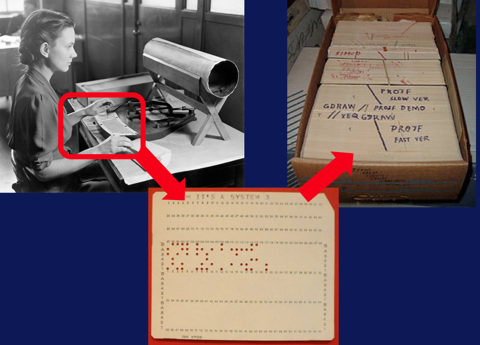

# foundation of big data systems and programming

## basic scalable computing concepts

> *It is not the beauty of a bulding you should look at; its the construction of the **foundation** that will **stand the test of time*** - David Allan Coe

### What is a Distributed File System?

When computers first came out, the information and programs were stored in punch cards. These punch cards were stored in file cabinets, just like the physical file cabinets today. This is where the name, **file system**, comes from. 

The need to store information in files comes from a larger need to store information in the long-term; **long-term information storage**:
- access result of a process later: the information lives after the computer program, or what we call process, that produced it terminates
- store large amounts of information: we might need to store large amounts of information that we cannot store within the program components or computer memory
- enable access of multiple processes: multiple processes can access the same information if needed

we store information in files on a hard disk. there are many files and the operating system manages them through its file system.

How this information is stored on disk drives has high impact on the **efficiency** and **speed** of access to data, especially in the big data case. 

While the files have exact addresses for their locations in the drive, referring to the data units of sequence of these blocks, that's called the **flat structure**, or hierarchy construction of index records, that's called the **database**. They also have human readable symbolic **names**, generally followed by an **extension**.

Extensions tell what kind of file it is, in general. Programs and users can access files with their names. The contents of a file can be numeric, alphabetic, alphanumeric, or binary executables.

> transcript of video [here](transcripts/dfs.md), slides [here](slides/week3/01-WhatIsADistributedFileSystem.pdf)

### Scalable Computing over the Internet

As a summary the commodity clusters are a cost effective way of achieving data parallel scalability for big data applications. These type of systems have a higher potential for partial failures. It is this type of distributed computing that pushed for a change towards cost effective reliable and Fault-tolerant systems for management and analysis of big data.

> transcript of video [here](transcripts/scalable.md), slides [here](slides/week3/02-ScalableComputingOverTheInternet-Altintas.pdf)
>
> handwritten notes of two past subjects [here](notes/concepts.pdf )

### Programming Models for Big Data

- transcript of video [here](transcripts/models.md)
- slides [here](slides/week3/03-ProgrammingModelsForBigData.pdf)
- [handwritten notes](notes/models.pdf)

# systems: getting started with Hadoop

- [transcript](transcripts/why.md)
- [slides]()

## getting started with Hadoop

> slides can be found on [this](slides/week3/hadoop/) folder

- [assignment](assignment/README.md)

  
## hands on

### downloading and installing

- [Downloading and Installing the Cloudera VM Instructions (Mac)](slides/Downloading_and_Installing_the_Cloudera_VM_Instructions_(Mac).pdf)
- [FAQ](slides/FAQ.pdf)

### running first application

1. [Copy your data into the Hadoop Distributed File System (HDFS) Instructions](slides/Copy_your_data_into_the_Hadoop_Distributed_File_System_(HDFS)_Instructions.pdf)
2. [Run the WordCount program](slides/Run_the_WordCount_program_Instructions.pdf)