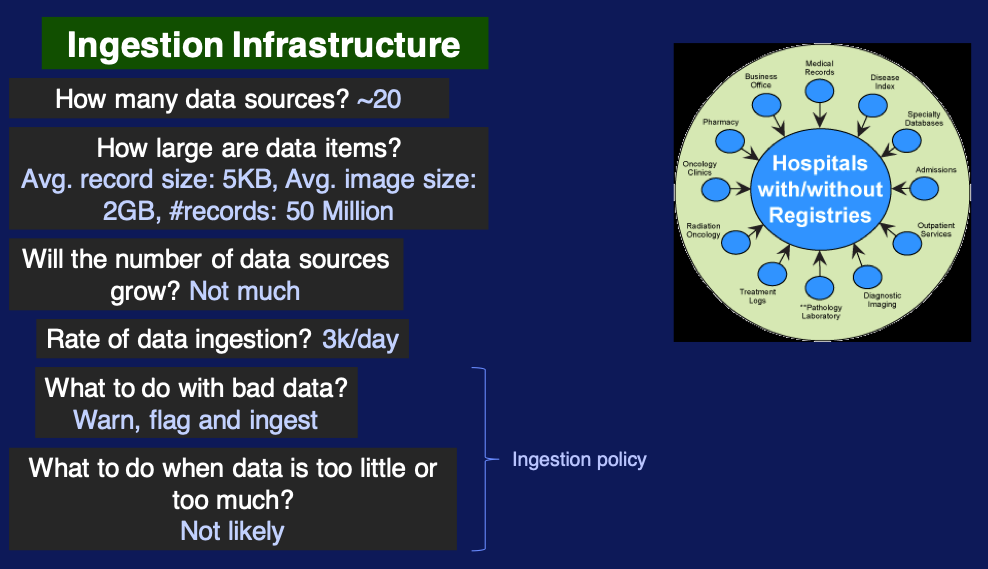
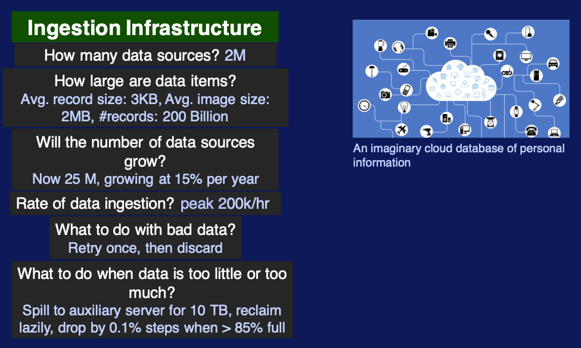

# Introduction to Big Data Modeling and Management

- goal of **data modeling**: explore the nature of data to figure out storage and proccesing
- goal of **data management**: figure out infrastructure support

## Why Big Data Modeling and Management?

### Summary of Introduction to Big Data

slides [here](slides/01-SummaryOfIntroductionToBigData.pdf)

### Big Data Management 

> slides [here](slides/02-BigDataManagement.pdf)

#### "Must-Ask Questions"

what is data management? must-ask questions about a data application, that range from how we get the data to how we work with it and how we secure it from malicious users

- [how do we ingest the data?](#data-ingestion)
- [where and how do we store it?](#data-storage)
- [how can we ensure data quality?](#data-quality)
- [what operations do we perform on data?](#data-operations)
- [how can these operations be efficient?]()
- [how do we scale up data volume, variety, velocity and access?](#data-scalability)
- [how to keep the data secure?](#data-security)

### data ingestion

**ingestion**: process of getting the data into the data system that we are building or using

large scale systems need more automation and it becomes a part of the big data management infrastructure, so here are questions to ask when automating data ingestion:
- how many data sources? 
- how large are data items?
- will the number of data sources grow?
- rate of data ingestion?
  
including ingestion policies:
- what to do with bad data? error handling policy (it is a rule)
- what to do when data id too little or too much?

#### examples

hospital

cloud

### data storage

issues:
- capacity
- scalability
  - network or direct
- speed
  - memory (storage) hierarchy
    - levels
    - speed in terms of response time

kind of storages:
- SSDs (Solid State Devices)
  - faster
  - flip side: cost
- NVM (Non-volatile memory)

we have the choice of architecting a storage infrastructure choosing how much of types of storage.

### data quality

issue of data quality: is data error-free and useful for the purpose?

reasons:
1. **actionable insight**: the ultimate use of big data is its ability to give it
   - better quality means better analytics and decision making 
2. **regulating** industries: quality assurance means needed for regulatory compliance
   - errors here can lead to legal complications
3. gain **trust as a provider**: quality leads to better engagement and interaction with external entities

data quality management: Gartner industry report on big data qualities to identify approaches to meeting the data quality requirements in the industry
- data profiling and data quality measurement
- parsing and standardization
- generalized cleansing
- matching
- monitoring
- issue resolution and workflow
- enrichment 

this methods
- include the adherence to standards where applicable
- refers to the need to create the rules in the data system that can be use to check if the data passes
- includes methods to clean the data if it's found to have errors or inconsistencies.

> data quality management should include a well define work flow on how low quality data could be corrected to bring it back to a high level of quality.

### data operations

aspect of data management: document, define, implement and test operations for application.

there are operations
- independent of type of data
- that require knowledge of data's nature to use data model

there are two broad divisions of operations:
1. operations on **single** data items that produce a sub-item
   - ex: crop image (extract sub array)
2. operations on **collections** of data items
   - operations that select a part of a collection (subset from set)
   - operations that combine two collections (merge, creating larger set)
   - compute function and return value (count)

every operator must be efficient (perform its task as fast as possible by taking up as little memory of disk as possible). **efficiency of data operations**:
- measured by time and space: time depends on size of input and output
- should use parallelism: operator can split its data and have different threads operate on pieces at the same time

#### example: selection

choosing a subset of a set based on some conditions 
1. partition randomly
2. apply concurrently the subset algorithm and get partial results
3. send partial results to output (in this case)

### data scalability and security

#### data scalability

decision between [**scaling up**](#scale-up) (making a machine (a server) more powerful) vs [**scaling out**](#scale-out) (adding more machines)

##### scale up

vertical scaling

involves:
- adding more memory
- adding more processors and RAM
- buying more expensive and robust server
- replacing processes 
- adding more processes within a system with a very fast internet connection speed 

**advantage**: many operations perform better with more memory, more cores

**disadvantage**: maintenance can be difficult and/or expensive

##### scale out

horizontal scale

> general trend in big data world targets this one

involves
- adding more (possibly less powerful) machines that interconnect over a (relatively) slower network

**advantage**: easier in practice to add more machines

**disadvantage**: parallel operations will possibly be slower

cluster management and management of data operations over a cluster is an important component in today's big data management systems.

#### data security

more sensitive data implies the need for more security. bigger challenge when data system is deployed in the cloud over multiple machines: ensure security for machines **and** network
- encrypt data as it gets to network
- decrypt when it gets to processing server
- result: increases operational cost

### reading on storage systems

The web page https://vanillavideo.com/blog/2014/started-storage-understanding-san-nas-das gives you an overview of the different storage options one may have in an information system.

## Real Big Data Management Applications

#### Energy Data Management Challenges at ConEd

if we were to design a big data system for such a company, you would need to understand how much are the computation can be executed in parallel and how many machines with what kind of capability are required to handle the data rate and the number and complexity of the analytical computations needed.

- slides [here](slides/03-ConEdExample.pdf)
- resources: https://www.greentechmedia.com/articles/read/new-york-prepares-for-millions-of-smart-meters-under-rev

#### Gaming Industry Data Management: Q&A with Apmetrix CTO Mark Caldwell

#### Flight Data Management at FlightStats: A Lecture by CTO Chad Berkley

[slides](slides/04-FlightStats-Data.pdf)
